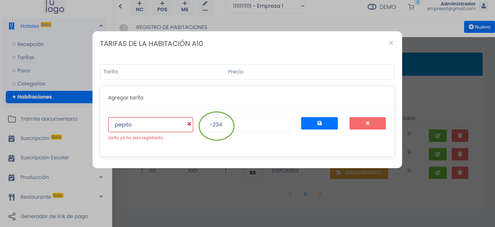

# Precio Negativo en la Sección de Tarifas

En la sección de tarifas de la aplicación, actualmente se permite ingresar un precio negativo. Esto no es deseable ya que no tiene sentido tener precios negativos en este contexto.

Se recomienda modificar la lógica de entrada de datos en la sección de tarifas para permitir únicamente números positivos. Esto garantizará la coherencia y la precisión en los cálculos relacionados con tarifas y pagos.

La presencia de precios negativos puede causar confusiones y errores en los cálculos de tarifas y pagos dentro de la aplicación. Además, puede llevar a resultados inesperados y no representativos de la realidad.

# Imagen de la Página Actual del Error:

