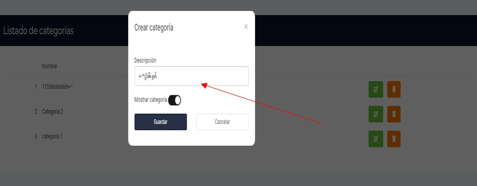

# La sección de listado de categorías permite agregar y guardar caracteres especiales.

:::danger[Descripción del Error]
En la sección de listado de categorías, se permite agregar y guardar caracteres especiales, lo cual es incorrecto y puede causar problemas en el sistema.
:::

:::tip[Posible Solución]
Limitar la entrada de caracteres especiales en la sección de listado de categorías, permitiendo solo caracteres alfanuméricos estándar y símbolos específicos según sea necesario.
:::

:::warning[Por qué ocurre]
El motivo de restringir la entrada de caracteres especiales en la sección de listado de categorías es evitar posibles vulnerabilidades y errores en el sistema. La inclusión de caracteres especiales puede interferir con el funcionamiento adecuado de la sección, causar conflictos de codificación o incluso abrir puertas a ataques de seguridad como inyecciones de código. Al limitar la entrada a caracteres alfanuméricos estándar y símbolos específicos necesarios, se promueve un uso correcto y seguro de la funcionalidad, reduciendo riesgos y garantizando la integridad del sistema.
:::

# Imagen de la Página Actual del Error:
