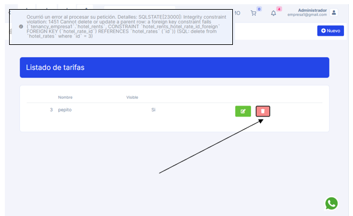

# Mensaje de error confuso en el sector listado de tarifas

:::danger[Descripción del Error]
El mensaje de advertencia en el sector listado de tarifas es muy confuso y de poco entendimiento, lo cual generaria confusion al recepcionista
:::

:::tip[Posible Solución]
La posible solucion es editar el mensaje para que el recepcionista tenga mejor entendimiento y tambien de paso agregar un boton el cual tenga las especificaciones tecnicas.
:::

:::warning[Por qué ocurre]
Ocurre porque muy posiblemente el mensaje, estaba enfocado solo a los administradores tecnicos.

:::
# Imagen de la Página Actual del Error:
