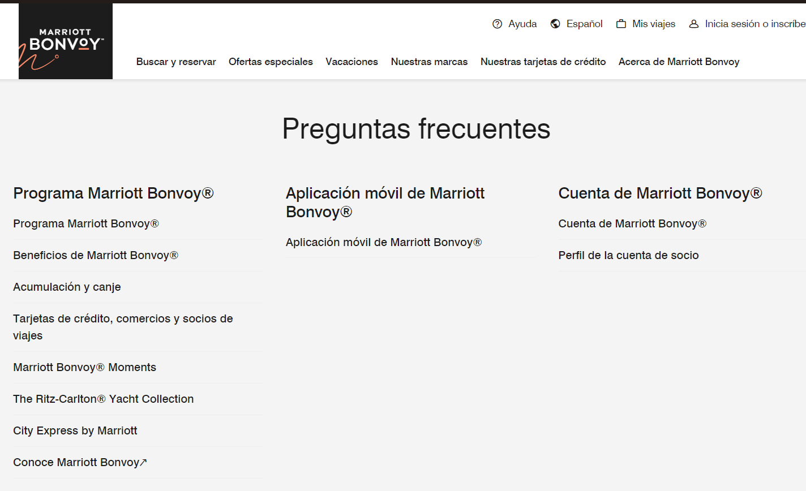

# Añadir área de preguntas frecuentes para los usuarios aea

**Descripción del Requerimiento:**
Implementar un área de blog donde se resuelva las preguntas mas comunes sobre el hotel , sus funcionalidades, etc. 

**Comparación con Otros Sistemas:**
Algunas plataformas de reserva, como Marriott Bonvoy o Hilton Honors, han incorporado asistentes virtuales en sus sitios web para facilitar la experiencia de reserva y atención al cliente.

# Imagen de la Página Actual para Referencia:

# Imagen de Referencia para Mejorar:

**Beneficios y Consideraciones:**
Un espacio de preguntas frecuentes evita confusiones a futuros clientes. Puede mejorar la confiabilidad de nuestra pagina y hoteles.
