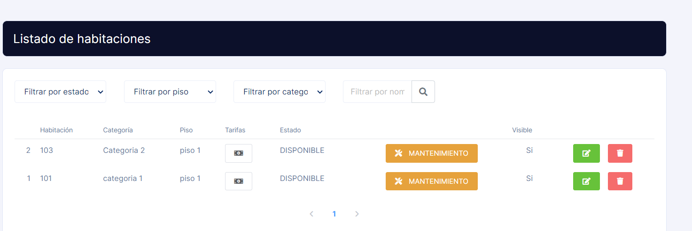

# Modificación de la opción de habitacion en limpieza en el listado de habitaciones

**Descripción del Requerimiento:**
Crear una alternativa de boton (tal como "mantenimiento") para poner el cuarto en estado limpieza 
**Comparación con Otros Sistemas:**
Sitios web de hoteles de renombre a menudo cuentan los cuartos en estado de limpieza y lo que a su vez avisa a los empleados para comenzar a limpiar el cuarto.

# Imagen de la Página Actual para Referencia:

# Imagen de Referencia para Mejorar:

**Beneficios y Consideraciones:**
Podria servir como aviso para los empleados de cuando deben comenzar a limpiar la habitación correspondiente, ademas evitaría confusiones con clientes.