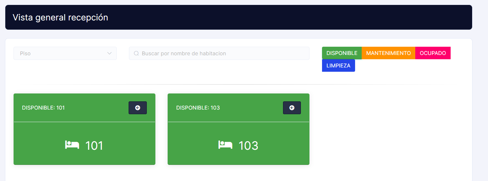

# Testimonios de Clientes

**Descripción del Requerimiento:**
Se busca implementar una sección de testimonios de clientes en el sitio web del hotel, donde los huéspedes puedan compartir sus experiencias y opiniones sobre su estancia.

**Comparación con Otros Sistemas:**
Muchos sistemas de reservas de hoteles y plataformas de gestión hotelera ofrecen la opción de mostrar testimonios de clientes en sus sitios web. Un ejemplo de esto es el sistema de gestión de propiedades (PMS) de Cloudbeds, que permite a los hoteles recopilar y mostrar testimonios

# Imagen de la Página Actual para Referencia:

# Imagen de Referencia para Mejorar:

**Beneficios y Consideraciones:**
Los testimonios de clientes auténticos pueden generar confianza en los usuarios potenciales y persuadirlos para que elijan el hotel, mejorando así la credibilidad del sitio web.

