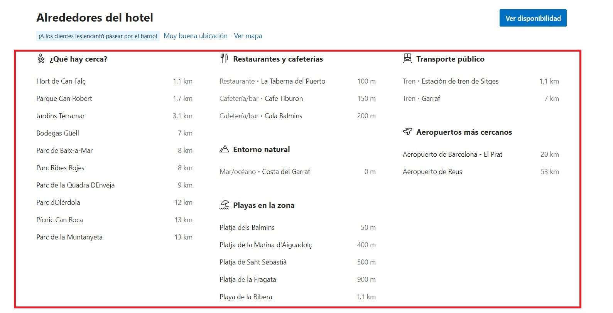

# Notificaciones de Reservas Pendientes

**Descripción del Requerimiento:**
Consiste en desarrollar un sistema que envíe notificaciones automáticas al administrador del hotel cada vez que se realice una nueva reserva y esta requiera atención inmediata. La notificación alertará al administrador sobre la existencia de una reserva recién realizada que necesita ser revisada y confirmada dentro de un plazo específico para garantizar una gestión eficiente de las reservas del hotel.

**Comparación con Otros Sistemas:**
En comparación con otros sistemas de gestión de reservas que pueden no incluir notificaciones automáticas, esta característica proporciona al administrador una alerta inmediata sobre nuevas reservas pendientes de confirmación. Mientras que algunos sistemas pueden requerir que el administrador acceda manualmente a la plataforma para revisar las reservas, este sistema automatizado garantiza una respuesta rápida y oportuna a las reservas recién realizadas.

# Imagen de Referencia para Mejorar:

**Beneficios y Consideraciones:**
Permite al administrador tomar medidas rápidas para confirmar o cancelar reservas según sea necesario, lo que facilita una gestión más proactiva del inventario de habitaciones del hotel.
