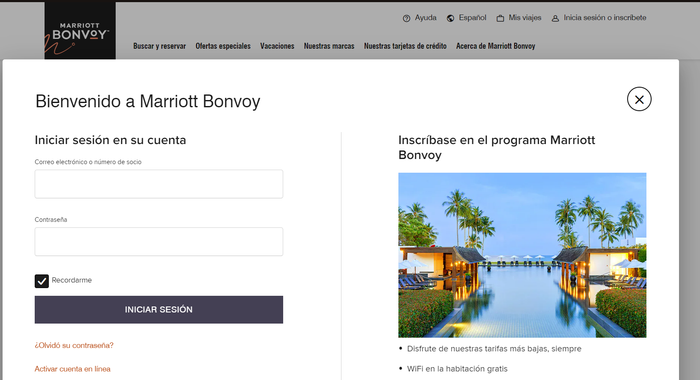

# Inicio de Sesión de Usuario

**Descripción del Requerimiento:**
Implementar un sistema de inicio de sesión de usuario que permita a los huéspedes registrados acceder a su cuenta personal desde la página web del hotel. Los usuarios podrán iniciar sesión utilizando su ID  y contraseña.

**Comparación con Otros Sistemas:**
Un ejemplo de un sistema que ofrece esta funcionalidad es el sistema de gestión hotelera (PMS) de Guestline, que incluye una función de pre-registro de huéspedes en línea. Los huéspedes reciben un correo electrónico antes de su llegada con un enlace a un formulario en línea donde pueden proporcionar los detalles necesarios para su registro.

# Imagen de la Página Actual para Referencia:

# Imagen de Referencia para Mejorar:

**Beneficios y Consideraciones:**
El inicio de sesión de usuario ofrece una experiencia personalizada al permitir que los huéspedes accedan fácilmente a su historial de reservas, realicen cambios en sus datos personales y gestionen sus preferencias de comunicación. Además, facilita futuras reservas al recordar la información del usuario, lo que puede aumentar la fidelidad del cliente y simplificar el proceso de reserva.
